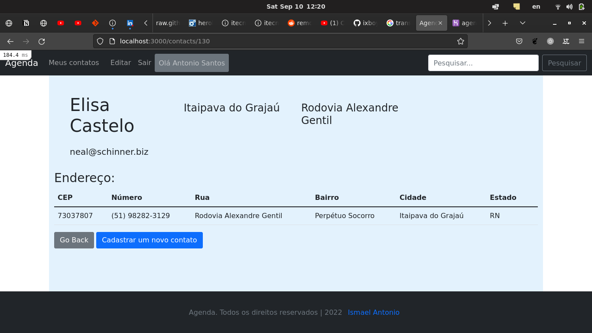
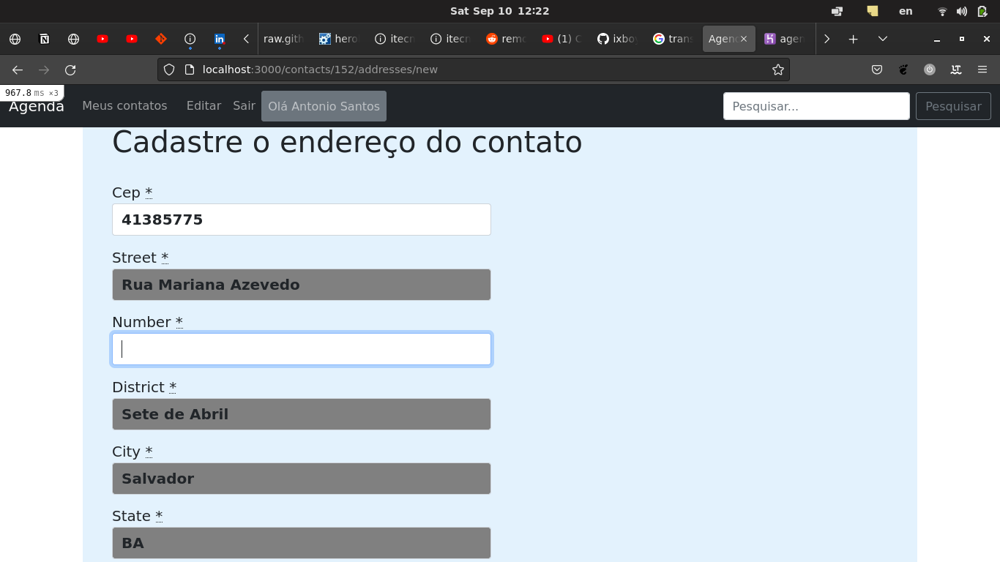
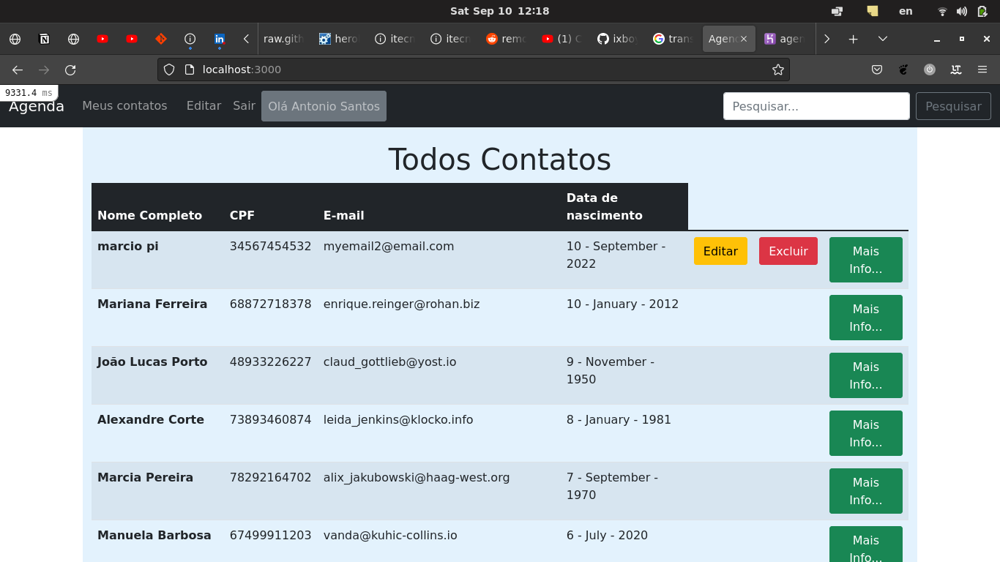

Este é um teste de Dev que recebi da empresa Leadster, Eu fui requerido para criar um aplicativo que sua tarefa consiste em criar um sistema para uma ​agenda de contatos, ela tem uma tela inicial que permite o usuario cadastrar os dados pessoais do seu contato, e depois de cadastrar o contacto, o usuário é redirecionado para uma outra tela para que possa obrigatoriamente digitar um numero CEP do Brazil de 8 digitos, depois de digitar o codigo CEP o aplicativo fara automaticamente um API request e voltara com dados sobre o endereço do CEP digitado.

Neste projeto eu utilizei o Ruby on Rails 6 no pattern MVC. Também utilizei algumas gems importantes do Ruby e do Rails e outras tecnologias como o Fetch() da linguagem javascript() para comunicar com o serviço no backend.

## Screenshot




  

- [Ruby](https://www.ruby-lang.org/en/) 3.0.1
- [Rails](https://guides.rubyonrails.org/getting_started.html) 6.1.3
- [PostgreSQL](https://www.postgresql.org/)
  - [Gems](https://rubygems.org/)
  - [Kaminari](https://github.com/kaminari/kaminari)
  - [REST Client](https://github.com/rest-client/rest-client)
  - [Faker](https://github.com/faker-ruby/faker)

## Live Demo

[Click here to view it live on Heroku](https://agenda-info-app.herokuapp.com)

## Initial settings to run the project

```bash
# clonar o projeto
git clone https://github.com/ixboy/agenda.git

# enter directory clonado
cd agenda

# instalar Rails dependencies
bundle install

# instalar Node dependencies
yarn install

# criar o development e o test databases
rails db:create

# criar tabelas do database
rails db:migrate

# popular a data do db:seed
rails db:seed

# run the project
rails s
```

### Pré-requisitos

- Ruby on Rails v6.x. Para aprender como instalar Ruby on Rails, siga este [link](https://guides.rubyonrails.org/getting_started.html)

### Utilização

- Começar o servidor digitando no terminal `rails s `  e depois clicar a tecla `Enter`

- Abrir `http://localhost:3000/` no teu browser.

- Inscreva-se com seu nome, e-mail e senha, e depois podes utilizar e curtir o aplicativo...


## Deployment

- O aplicativo Web está deployed no Heroku...

## Author

👤 **Iyunda Ismael Antonio**

- GitHub: [@ixboy](https://github.com/ixboy)
- Twitter: [@ismaelixboy](https://twitter.com/ismaelixboy)
- LinkedIn: [ismael-antonio](https://www.linkedin.com/in/ismaelantonio/)


## Acknowledgments

### Leadster  --obrigado pela idea.
